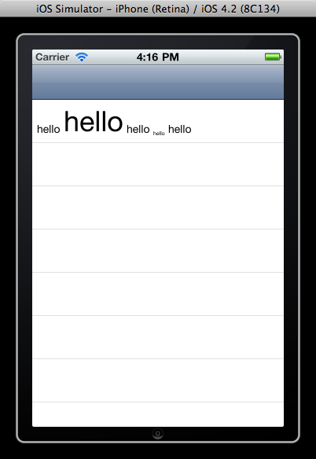

Demo of Three20 baseline bug
============================

Files
-----

* "BaselineTest", a sample project to reproduce the bug.  **Important:** This project will not
  compile until you link Three20 to it.  To do that:

        $ cd <your-three20-dir>/src/scripts
        $ python ttmodule.py <path>/three20-baseline-bug/BaselineTest/BaselineTest.xcodeproj -c Debug -c Release Three20

* Two screenshots: "before-patch.png" screenshot shows the result of running the BaselineTest app
  when linked to a normal, unpatched Three20 library; you can see the baseline bug.  The
  "after-patch.png" screenshot shows the same app running after my patch has been applied
  to Three20; the baseline of the text lines up properly.

Before: 

After: 
